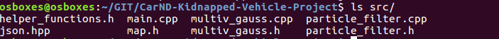
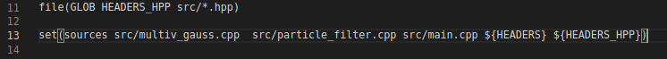
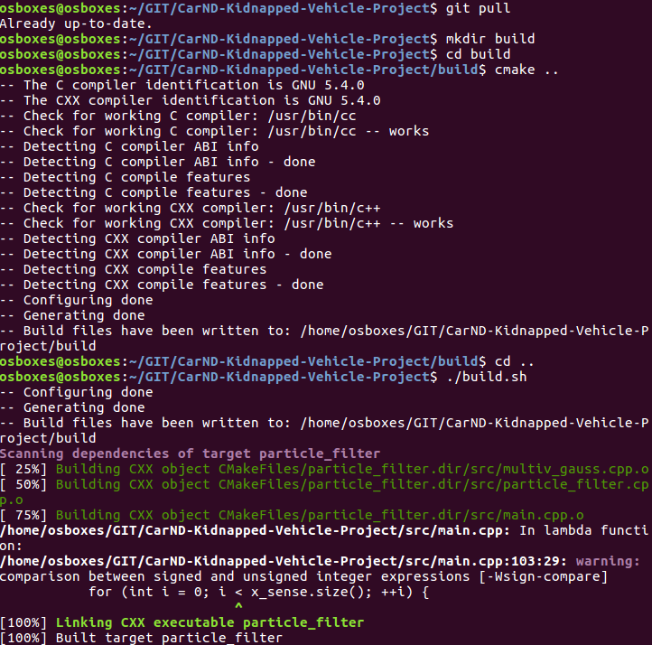
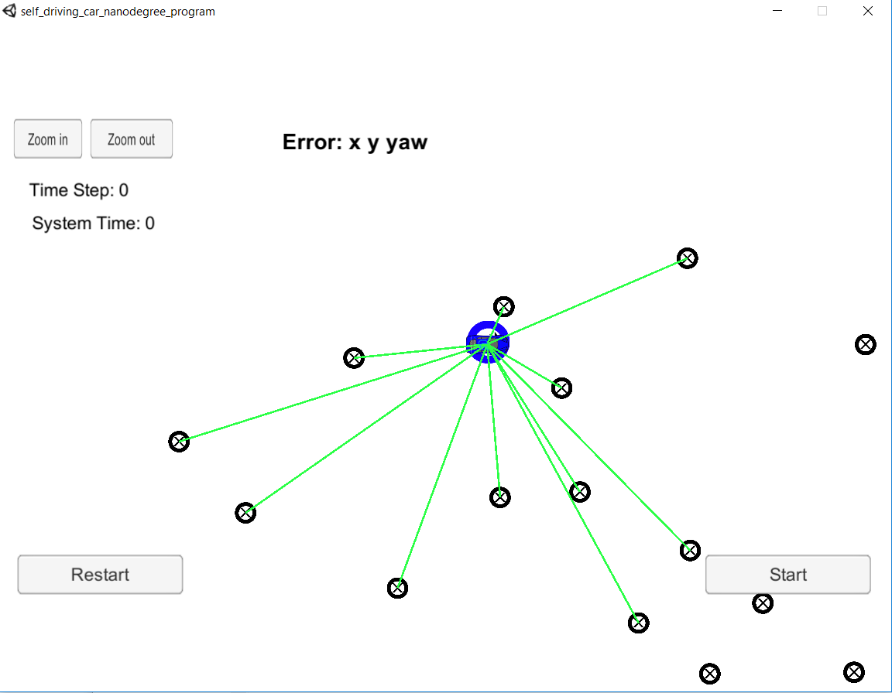
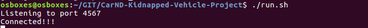
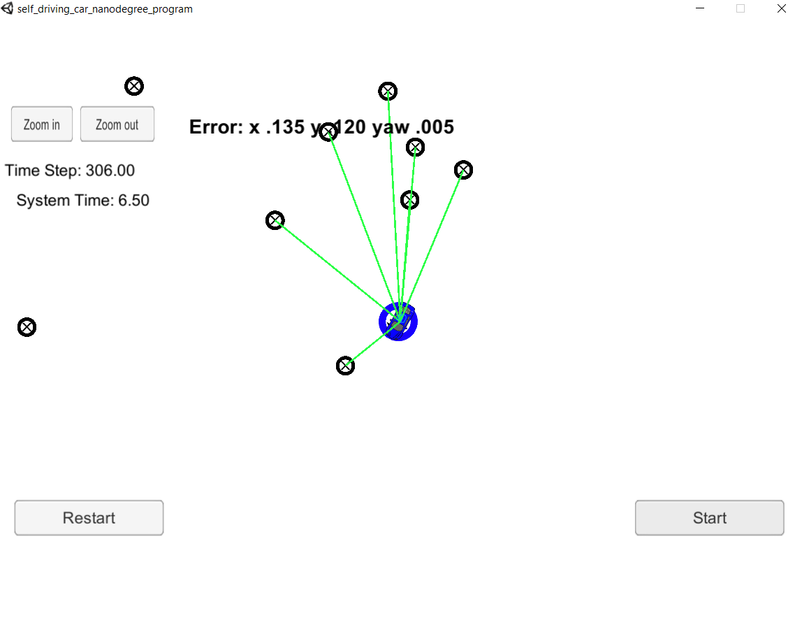
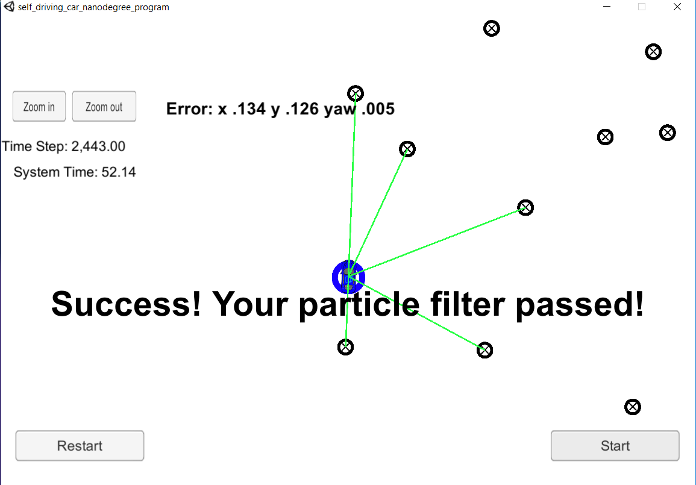

This is a project in Udacity Nanodegree for Self-driving car, forked from [CarND-Kidnapped-Vehicle-Project](https://github.com/udacity/CarND-Kidnapped-Vehicle-Project).

# Particle Filter
The goal of this project is to implement a particle filter and follow a car in a 2D simulation environment. Following tasks have been completed:

1. src/particle_filter.cpp is completed according to the instructions given in the file and steps as described in the lesson.
2. Two files, multiv_gauss.h and multiv_gauss.cpp, are taken from Tiffany's lessons for calculation of weights and added to src directory.

3. These two files are added in the list of source files in CMakeLists.txt so that they will be compiled and linked.

After the above steps, the source code can be compiled and linked to make an executable. Note that the uWebSockets must have been installed to make the connection between the particle filter and the simulator possible. The script build.sh, provided in the project, builds the applicaiton as shown in the below figure.

Once the executable is available the particle filter applicaiton can be launched using the run.sh script available in the project. Launching the application, will start the filter and wait for connection from the simulator. The connection will be established once the simulator is launched, as presented below.

Pushing the 'Start' button will start the simulation and particle filter will localize the car. The car is accurately followed and the simulation ends with the final expected message 'Success! Your particle filter passed!'.

 

 
